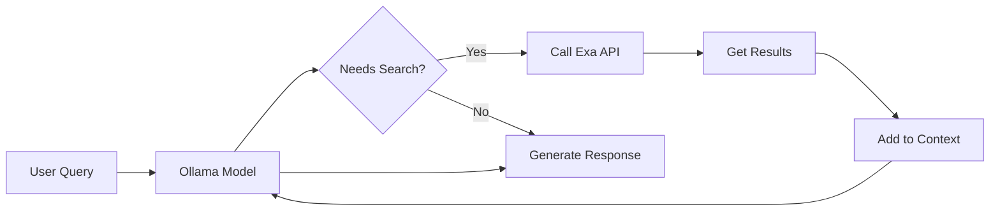

# Exa Web Search Integration

This document describes the Exa web search integration for Ollama models with native tool calling support.

## Overview

The application now supports AI-powered web search using Exa's neural search API, which is specifically designed for AI applications. When enabled, compatible models can autonomously decide when to search the web for current information.

## Prerequisites

1. **Exa API Key**: Sign up at [exa.ai](https://exa.ai) to get your API key
   - Free tier includes $10 credits (~1000 searches)
   - Dashboard: [dashboard.exa.ai/api-keys](https://dashboard.exa.ai/api-keys)

2. **Compatible Models**: Web search is supported for models with native function calling:
   - GPT-OSS models (20B, 120B)
   - Llama 3.1 (70B)
   - Llama 3.2

## Configuration

### 1. Install Dependencies

```bash
pip install exa-py ollama
```

### 2. Environment Variables

Add to your `.env` file:

```env
# Exa Search Configuration
EXA_API_KEY=your_exa_api_key_here
EXA_SEARCH_ENABLED=true

# Ollama Configuration (if not using default)
OLLAMA_BASE_URL=http://localhost:11434
```

### 3. Enable Search in UI

1. Select an Ollama model that supports tool calling
2. The web search checkbox will become available
3. Check "🔍 Web Search" to enable for the conversation

## How It Works

### Architecture

1. **Native Tool Calling**: GPT-OSS and compatible models support function calling natively
2. **Automatic Invocation**: The model decides when to search based on the conversation context
3. **Semantic Search**: Exa uses embeddings for meaning-based search, not just keywords
4. **Result Integration**: Search results are automatically incorporated into the model's response

### Search Flow



## Usage Examples

### Basic Search

When web search is enabled, the model will automatically search when needed:

```
User: "What are the latest developments in quantum computing in 2025?"
Model: [Searches web automatically] Based on recent developments...
```

### Search Categories

The integration supports category filters:
- `news` - Recent news articles
- `papers` - Academic papers
- `company` - Company information
- `tweet` - Twitter/X posts
- `github` - GitHub repositories
- `personal_site` - Personal websites

### Domain Filtering

You can configure domain inclusion/exclusion in the search service:

```python
# In search_service.py
search_results = await search_service.search(
    query="AI safety",
    include_domains=["arxiv.org", "openai.com"],
    exclude_domains=["reddit.com"]
)
```

## API Reference

### Search Service Methods

#### `search(query, **kwargs)`
Perform a web search with various filters.

**Parameters:**
- `query` (str): Search query
- `num_results` (int): Number of results (default: 5)
- `use_autoprompt` (bool): Use Exa's autoprompt feature (default: True)
- `category` (str): Filter by category
- `include_domains` (List[str]): Domains to include
- `exclude_domains` (List[str]): Domains to exclude
- `start_published_date` (str): Start date filter (YYYY-MM-DD)
- `end_published_date` (str): End date filter (YYYY-MM-DD)

#### `find_similar(url, num_results=5)`
Find pages similar to a given URL.

#### `get_contents(urls)`
Retrieve full text content for URLs.

## Tool Definition

The search tool is defined for Ollama's function calling:

```python
{
    "type": "function",
    "function": {
        "name": "web_search",
        "description": "Search the web for current information",
        "parameters": {
            "type": "object",
            "properties": {
                "query": {"type": "string"},
                "num_results": {"type": "integer", "default": 5},
                "category": {"type": "string", "enum": ["news", "papers", ...]},
                ...
            },
            "required": ["query"]
        }
    }
}
```

## Monitoring & Debugging

### Check Service Status

```python
from app.services.search_service import search_service

# Check if search is enabled
print(f"Search enabled: {search_service.enabled}")
print(f"API key configured: {bool(search_service.api_key)}")
```

### View Logs

```bash
# Set log level to DEBUG for detailed information
LOG_LEVEL=DEBUG python main.py
```

### Test Search Directly

```python
import asyncio
from app.services.search_service import search_service

async def test_search():
    results = await search_service.search("latest AI news", num_results=3)
    for result in results:
        print(f"- {result.title}: {result.url}")

asyncio.run(test_search())
```

## Limitations

1. **API Credits**: Free tier is limited to $10 credits
2. **Rate Limits**: Respect Exa's rate limits (varies by plan)
3. **Model Support**: Only works with models that support function calling
4. **Context Length**: Search results add to context, consider token limits

## Troubleshooting

### Search Not Available

1. Check model compatibility (must support function calling)
2. Verify EXA_API_KEY is set correctly
3. Ensure EXA_SEARCH_ENABLED=true
4. Check Ollama is running and accessible

### No Search Results

1. Verify API key is valid
2. Check network connectivity
3. Review search query formatting
4. Check logs for specific errors

### Integration Issues

1. Ensure all dependencies are installed: `pip install exa-py ollama`
2. Verify Ollama model supports tools: `ollama show model-name`
3. Check Python version compatibility (3.8+)

## Cost Optimization

1. **Limit Results**: Use `num_results=3` for most queries
2. **Cache Results**: Implement caching for repeated queries
3. **Category Filters**: Use specific categories to reduce API calls
4. **Domain Filters**: Limit to relevant domains when possible

## Security Considerations

1. **API Key**: Never commit EXA_API_KEY to version control
2. **Input Validation**: The service validates all search parameters
3. **Result Filtering**: Consider filtering sensitive content
4. **Rate Limiting**: Implement user-level rate limits for production

## Future Enhancements

- [ ] Result caching with Redis
- [ ] Custom relevance scoring
- [ ] Multi-language search support
- [ ] Search history tracking
- [ ] Advanced filtering UI
- [ ] Alternative search providers (DuckDuckGo, Tavily)